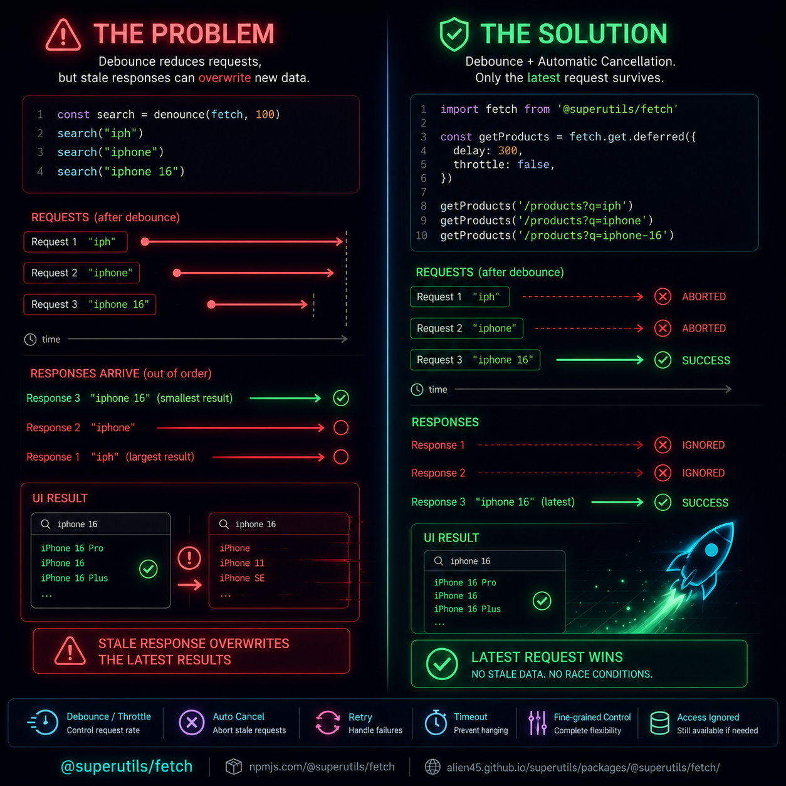

<h2 class="page-title">
The Problem Debouncing Doesn't Solve
</h2>

<h3 class="page-subtitle">
  Preventing stale responses and race conditions in modern applications
</h3>

_Author: [Toufiqur Rahaman Chowdhury](https://alien45.github.io/cv)_ • Published: 2026-06-19 • [← Back to Journal Home](../)



## The Problem

Most developers know how to debounce a search input.

```js
const search = debounce(fetch, 100);

search("iph");
search("iphone");
search("iphone 16");
```

The goal is usually to avoid flooding the server with requests.

But there's another problem that often gets overlooked. It usually doesn't show up until production traffic starts hitting your application.

What happens when an older request is still in flight?

A common scenario:

1.  User searches "**iph**"
2.  Request is sent
3.  User quickly types "**iphone 16**"
4.  New request is sent
5.  The old request finishes last

Now stale data can overwrite the latest results.

_Debouncing reduces request frequency, but it doesn't automatically solve request lifecycle management._

## The Solution

When I built [`@superutils/fetch`](https://npmjs.com/@superutils/fetch), I wanted debounce/throttle utilities that also handle stale requests automatically.

```js
import fetch from "@superutils/fetch";

const getProducts = fetch.get.deferred({
  delay: 300,
});

getProducts("/products?q=iph");
getProducts("/products?q=iphone");
getProducts("/products?q=iphone-16");
```

Only the latest request survives.

Any pending request that becomes obsolete is automatically aborted.

Need more control?

```js
const getProducts = fetch.get.deferred({
  delay: 300,
  ignoreStale: true,
  resolveIgnored: ResolveIgnored.WITH_LAST,
  retry: 3,
  timeout: 10_000,
});
```

This adds:

✅ Debouncing or throttling  
✅ Automatic cancellation of stale requests  
✅ Protection against stale UI updates  
✅ Retry support  
✅ Request timeouts  
✅ Fine-grained control over ignored requests

Search inputs are the obvious use case, but I've found the same pattern useful for:

- autosave flows
- token refresh requests
- live filters
- infinite scrolling
- real-time dashboards

How are you handling stale requests and race conditions in your applications today?

## Check out @superutils/fetch

- [**NPM**](https://www.npmjs.com/package/@superutils/fetch)
- [**Documentation & playground**](https://alien45.github.io/superutils/packages/@superutils/fetch/)
- [**Source Code**](https://github.com/alien45/superutils/tree/main/packages/fetch)

## Related Discussions

This article is also shared on the following platforms, where you can comment, like, or reshare:

- [LinkedIn](https://www.linkedin.com/feed/update/urn:li:activity:7473699390872858624/)
- [X (Twitter)](https://x.com/toufiq1618/status/2068007109417947343)
<!-- - [dev.to](https://dev.to/alien45/..........) -->

### 👤 About the Author

Toufiqur Rahaman Chowdhury is a full-stack software developer with over 8 years of experience building scalable web applications. He’s worked across frontend, backend, and blockchain systems.

🔗 [← Back to Journal Home](../)
• [CV](https://alien45.github.io/cv)
• [LinkedIn](https://www.linkedin.com/in/toufiq/)
• [GitHub](https://github.com/alien45)
• [Contact / Hire Me](https://alien45.github.io/cv/Toufiqur_Chowdhury_CV.pdf)

<link rel="stylesheet" href="../assets/style.css" />
